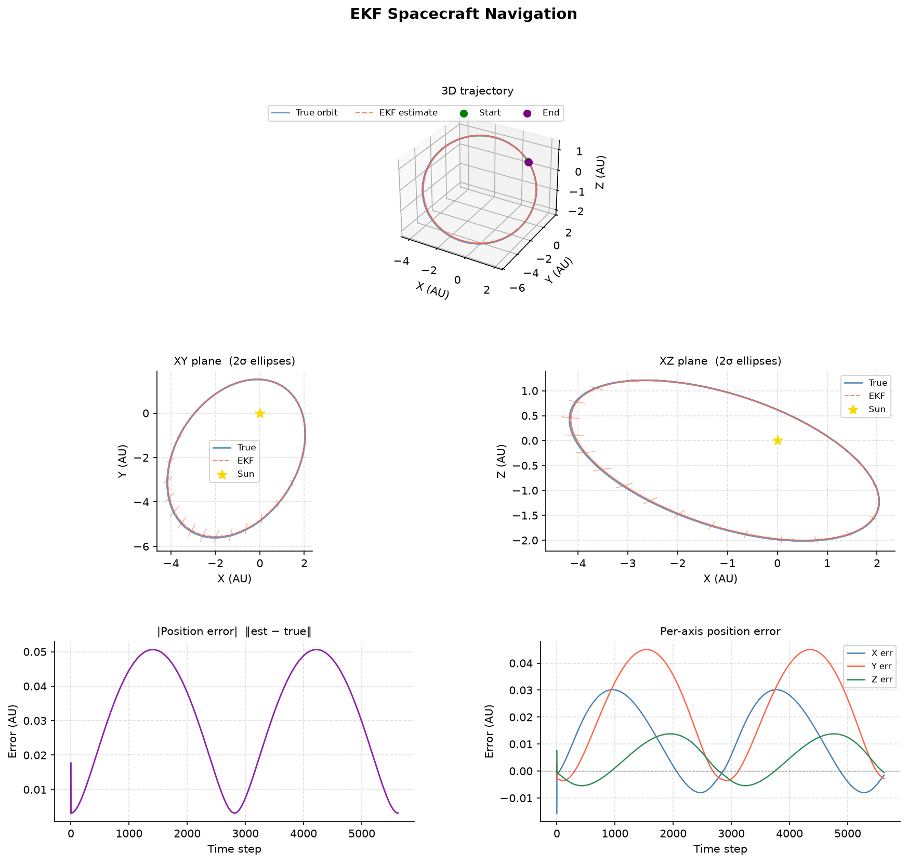
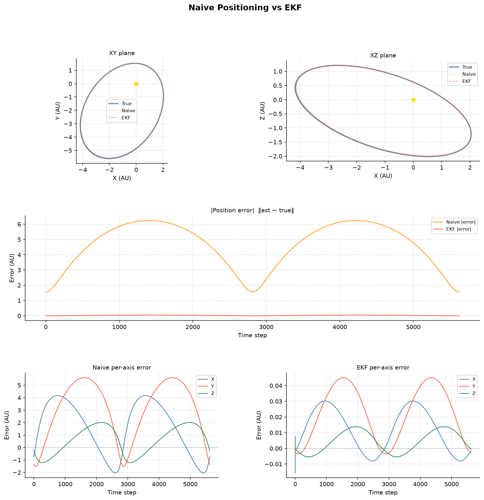
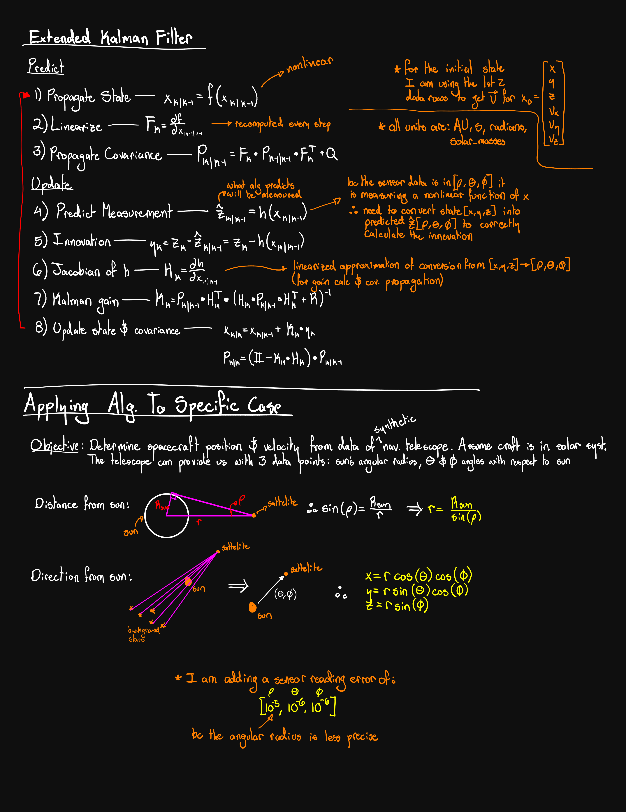
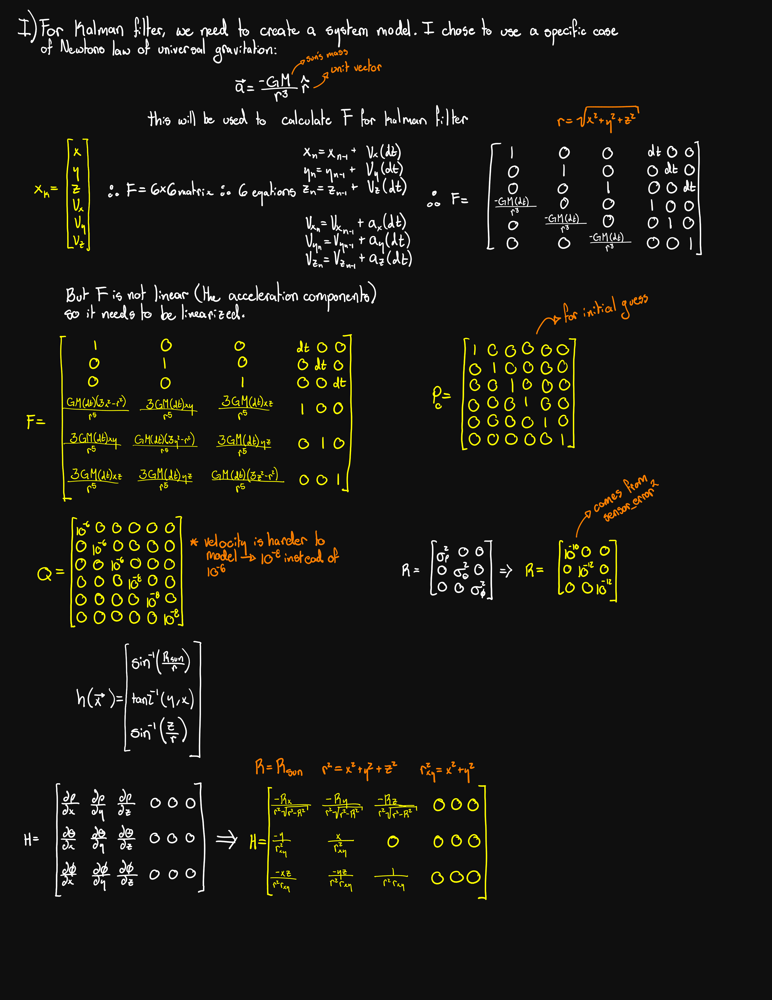

# Spacecraft-Navigation-Extended-Kalman-Filter-
Autonomous deep-space navigation using an Extended Kalman Filter (EKF) fusing three optical sensors: solar angular radius and star-tracker angles.

---
 
## Overview
 
This project implements an EKF to estimate a spacecraft's 3D position and velocity in heliocentric Cartesian coordinates `[x, y, z, vx, vy, vz]` using only passive optical measurements. The orbit used for testing is a highly elliptical asteroid-belt trajectory (semi-major axis 3.9 AU, eccentricity 0.6), which stresses the filter at aphelion where the sun appears smallest and sensor accuracy degrades.
 
---
 
## Results
 
### EKF vs true orbit
 

 
The EKF tracks the true orbit with a maximum position error of **~0.05 AU** (~7.5 million km) at aphelion. The 2σ uncertainty ellipses in the XY and XZ projections correctly inflate in the radial direction at aphelion — where the sun sensor is least informative — and shrink at perihelion.
 
### Naive positioning vs EKF
 

 
Direct inversion of the sensor readings (naive positioning) peaks at **~6.2 AU error** at aphelion. The EKF stays below 0.05 AU at the same point — a **~120× improvement** — by using orbital mechanics as a predictive model rather than treating each measurement independently.
 
---
 
## Sensors
 
| Sensor | Measurement | Symbol |
|---|---|---|
| Solar disk imager | Angular radius of the sun | ρ |
| Star tracker | Azimuth angle relative to background stars | θ |
| Star tracker | Elevation angle relative to background stars | φ |
 
Together `[ρ, θ, φ]` give full 3D position in spherical heliocentric coordinates, which the filter converts to and from Cartesian internally.
 
---
 
## Derivation notes
 
The full derivation of the EKF algorithm, state transition matrix F, measurement function h(x), Jacobian H, and the geometry for recovering position from `[ρ, θ, φ]` is shown in the handwritten notes below.
 
### EKF algorithm and sensor geometry
 

 
### System model, F matrix, Q, R, h(x) and H
 

 
---
 
## Units
 
| Quantity | Unit |
|---|---|
| Position | AU |
| Velocity | AU / s |
| Time step | 86400 s (1 day) |
| GM | 3.964 × 10⁻¹⁴ AU³ s⁻² |
| R_sun | 0.002325 AU |
| Angles | radians |
 
---
 
## File structure
 
```
├── generate_orbits.py          # Keplerian orbit integrator, physical constants
├── star_tracker.py             # Sensor simulation, h(x), coordinate conversions
├── kalman_ekf.py               # EKF: predict, update, Jacobians F and H
├── plot_kalman_ekf.py          # Diagnostic plots: EKF and naive vs EKF comparison
├── ekf_plot.png                # EKF result — trajectory and uncertainty ellipses
├── comparison_plot.png         # Naive positioning vs EKF error comparison
├── kalman_filter_annotated-1.png   # Handwritten notes — algorithm and geometry
└── kalman_filter_annotated-2.png   # Handwritten notes — matrices and derivation
```
 
---
 
## Parameters
 
```python
# Orbit
a            = 3.9     # semi-major axis (AU)
e            = 0.6     # eccentricity
inclination  = 30.0    # degrees
lon_asc_node = 45.0    # degrees
arg_peri     = 20.0    # degrees
 
# Sensor noise (1σ, radians)
sigma_rho   = 1e-5     # solar angular radius — noisier at distance
sigma_theta = 1e-6     # star tracker azimuth
sigma_phi   = 1e-6     # star tracker elevation
 
# Filter tuning
Q_pos = 1e-6           # process noise, position (AU²)
Q_vel = 1e-8           # process noise, velocity (AU/s)²
```
 
---
 
## Usage
 
```python
from kalman_ekf import init_state, kalman_alg, naive_positioning
from plot_kalman_ekf import plot_ekf, plot_comparison
 
init_orbit_state = [3.9, 0.6, 30.0, 45.0, 20.0]   # [a, e, inc, Ω, ω]
sensor_error     = [1e-5, 1e-6, 1e-6]               # [σ_ρ, σ_θ, σ_φ]
 
sensor_data, orbit_path = init_state(init_orbit_state, sensor_error)
states, P = kalman_alg(sensor_data, sensor_error)
 
plot_ekf(states, P, orbit_path, output_path="ekf_plot.png")
plot_comparison(states, naive_positioning(sensor_data), orbit_path,
                output_path="comparison_plot.png")
```
 
---
 
## Dependencies
 
```
numpy
matplotlib
```
 
---
 
## Limitations
 
The residual ~0.05 AU error at aphelion is a fundamental observability limit of the current sensor suite. At large heliocentric distances the sun's angular radius shrinks and `dr/dρ = -R_sun/sin²(ρ)` blows up, making radial distance hard to measure precisely.
